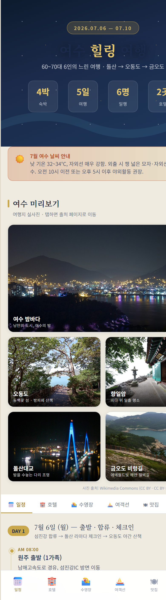
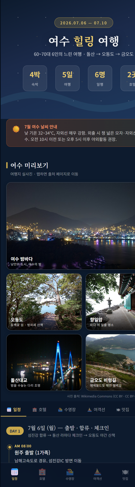

# 여수 힐링 여행 🌊

여수 4박5일 힐링여행 일정 안내 웹앱입니다. 오동도, 돌산, 향일암, 금오도 비렁길 등 주요 명소를 DAY1~DAY5 일정으로 정리했습니다. **폰 우선(mobile-first)** 디자인에 **라이트/다크 테마**를 지원합니다.

## 🔗 라이브 페이지

👉 **https://safety123-design.github.io/yeosu-trip/**

## 📱 미리보기

| 라이트 모드 | 다크 모드 |
|:---:|:---:|
|  |  |

> 시스템 설정을 자동 감지하며, 우상단 ☀️/🌙 버튼으로 직접 전환할 수 있습니다(선택은 저장됨). 여행지 사진은 [Wikimedia Commons](https://commons.wikimedia.org/) 자유 라이선스(CC BY · CC BY-SA · KOGL Type 1) 실사진입니다.

## 구성

- `index.html` — 여행 일정 단일 페이지 앱 (별도 의존성 없음, 브라우저에서 바로 열림)
- `assets/` — 미리보기 스크린샷(라이트/다크)

## 주요 기능

- 📅 일정 · 🏨 호텔 · 🏊 수영장 · ⛵ 여객선 · 🍽 맛집 · 💡 팁 탭 구성
- 🌗 라이트/다크 테마 (시스템 자동 + 수동 토글 + localStorage 저장)
- 📱 폰 우선 반응형 (데스크톱에서는 폰 프레임으로 중앙 정렬)
- 🖼 여수 명소 실사진 갤러리

## 로컬에서 열기

저장소를 클론한 뒤 `index.html`을 브라우저로 열면 됩니다.

```bash
git clone https://github.com/safety123-design/yeosu-trip.git
cd yeosu-trip
# index.html 더블클릭 또는 브라우저로 열기
```

## 수정 / 재배포

`index.html`을 수정한 뒤 커밋·푸시하면 GitHub Pages가 1~2분 내 자동 재배포합니다.

```bash
git add index.html
git commit -m "내용 수정"
git push
```

## 배포

GitHub Pages (브랜치 `main`, 경로 `/`)로 배포됩니다.
